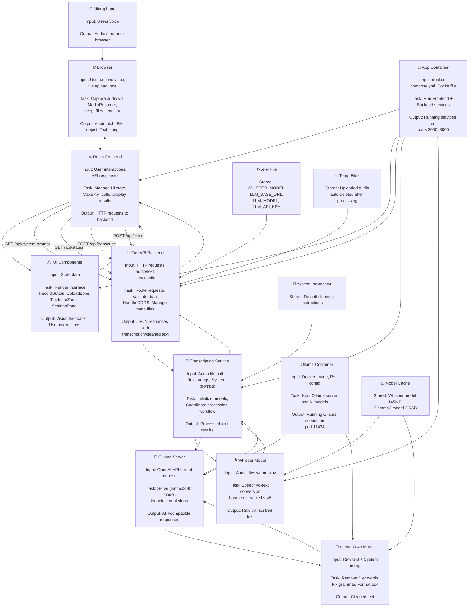

# System Architecture Diagram

```mermaid

graph TD

    %% User Interface
    Browser["🌐 Browser<br/><br/>Input: User actions voice, file upload, text<br/><br/>Task: Capture audio via MediaRecorder,<br/>accept files, text input<br/><br/>Output: Audio blob, File object, Text string"]

    Microphone["🎤 Microphone<br/><br/>Input: Users voice<br/><br/>Output: Audio stream to browser"]

    %% Frontend
    ReactApp["⚛️ React Frontend<br/><br/>Input: User interactions, API responses<br/><br/>Task: Manage UI state,<br/>Make API calls, Display results<br/><br/>Output: HTTP requests to backend"]

    Components["📦 UI Components<br/><br/>Input: State data<br/><br/>Task: Render interface<br/>RecordButton, UploadZone,<br/>TextInputZone, SettingsPanel<br/><br/>Output: Visual feedback, User interactions"]

    %% Backend
    FastAPI["🚀 FastAPI Backend<br/><br/>Input: HTTP requests audio/text,<br/>.env config<br/><br/>Task: Route requests, Validate data,<br/>Handle CORS, Manage temp files<br/><br/>Output: JSON responses with<br/>transcription/cleaned text"]

    TranscriptionService["🔄 Transcription Service<br/><br/>Input: Audio file paths,<br/>Text strings, System prompts<br/><br/>Task: Initialize models,<br/>Coordinate processing workflow<br/><br/>Output: Processed text results"]

    %% AI Models
    Whisper["🎙️ Whisper Model<br/><br/>Input: Audio files webm/wav<br/><br/>Task: Speech-to-text conversion<br/>base.en, beam_size=5<br/><br/>Output: Raw transcribed text"]

    Ollama["🤖 Ollama Server<br/><br/>Input: OpenAI API format requests<br/><br/>Task: Serve gemma3:4b model,<br/>Handle completions<br/><br/>Output: API-compatible responses"]

    Gemma["🧠 gemma3:4b Model<br/><br/>Input: Raw text + System prompt<br/><br/>Task: Remove filler words,<br/>Fix grammar, Format text<br/><br/>Output: Cleaned text"]

    %% Docker Containers
    AppContainer["🐳 App Container<br/><br/>Input: docker-compose.yml, Dockerfile<br/><br/>Task: Run Frontend + Backend services<br/><br/>Output: Running services on<br/>ports 3000, 8000"]

    OllamaContainer["🐳 Ollama Container<br/><br/>Input: Docker image, Port config<br/><br/>Task: Host Ollama server and AI models<br/><br/>Output: Running Ollama service on<br/>port 11434"]

    %% Storage
    EnvConfig["⚙️ .env File<br/><br/>Stored: WHISPER_MODEL,<br/>LLM_BASE_URL,<br/>LLM_MODEL, LLM_API_KEY"]

    SystemPrompt["📝 system_prompt.txt<br/><br/>Stored: Default cleaning instructions"]

    TempFiles["📁 Temp Files<br/><br/>Stored: Uploaded audio<br/>auto-deleted after processing"]

    ModelCache["💾 Model Cache<br/><br/>Stored: Whisper model 145MB,<br/>Gemma3 model 3.5GB"]

    %% Connections
    Microphone --> Browser
    Browser --> ReactApp
    ReactApp --> Components
    Components --> ReactApp

    %% API Calls - Sequential Flow
    ReactApp -->|GET /api/system-prompt| FastAPI
    ReactApp -->|GET /api/status| FastAPI
    ReactApp -->|POST /api/transcribe| FastAPI
    ReactApp -->|POST /api/clean| FastAPI

    %% Backend Flow - Sequential
    FastAPI --> TranscriptionService
    TranscriptionService --> Whisper
    Whisper --> TranscriptionService
    TranscriptionService --> Ollama
    Ollama --> Gemma
    Gemma --> Ollama
    Ollama --> TranscriptionService
    TranscriptionService --> FastAPI
    FastAPI --> ReactApp
    ReactApp --> Browser

    %% Storage Connections - Sequential
    EnvConfig --> FastAPI
    SystemPrompt --> TranscriptionService
    TempFiles --> FastAPI
    ModelCache --> Whisper
    ModelCache --> Gemma

    %% Docker Container Relationships - Sequential
    AppContainer --> ReactApp
    AppContainer --> Components
    AppContainer --> FastAPI
    AppContainer --> TranscriptionService
    AppContainer --> Whisper
    OllamaContainer --> Ollama
    OllamaContainer --> Gemma

```
