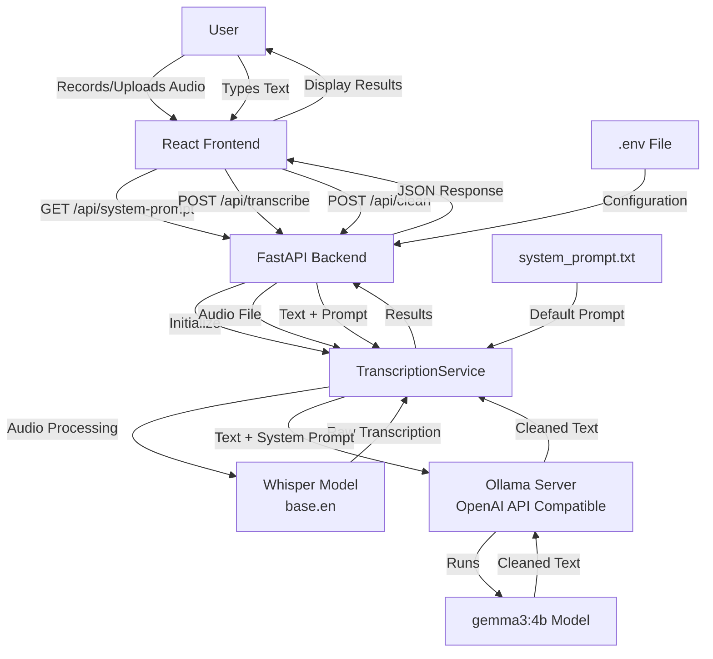

# Data Flow Diagram (DFD)

```mermaid
flowchart TD
    User -->|Records/Uploads Audio| Frontend[React Frontend]
    User -->|Types Text| Frontend
    Frontend -->|GET /api/system-prompt| Backend[FastAPI Backend]
    Frontend -->|POST /api/transcribe| Backend
    Frontend -->|POST /api/clean| Backend
    Backend -->|Initialize| TranscriptionService[TranscriptionService]
    Backend -->|Audio File| TranscriptionService
    Backend -->|Text + Prompt| TranscriptionService
    TranscriptionService -->|Audio Processing| Whisper[Whisper Model<br/>base.en]
    Whisper -->|Raw Transcription| TranscriptionService
    TranscriptionService -->|Text + System Prompt| Ollama[Ollama Server<br/>OpenAI API Compatible]
    Ollama -->|Runs| Gemma[gemma3:4b Model]
    Gemma -->|Cleaned Text| Ollama
    Ollama -->|Cleaned Text| TranscriptionService
    TranscriptionService -->|Results| Backend
    Backend -->|JSON Response| Frontend
    Frontend -->|Display Results| User
    Config[.env File] -->|Configuration| Backend
    SystemPrompt[system_prompt.txt] -->|Default Prompt| TranscriptionService
```
